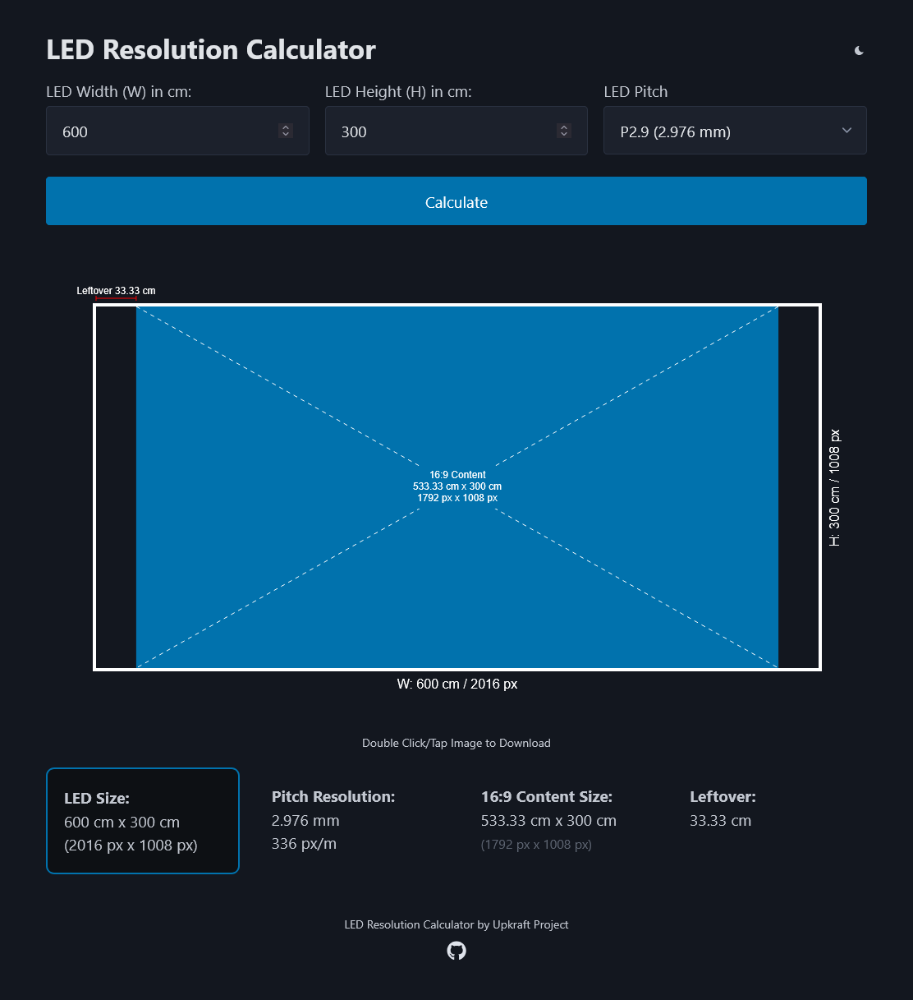

# LED Resolution Calculator

Alat berbasis web dengan tampilan modern untuk menghitung resolusi layar LED berdasarkan ukuran fisik (meter) dan pixel pitch (mm) — lengkap dengan pratinjau tampilan konten 16:9 secara real-time.

